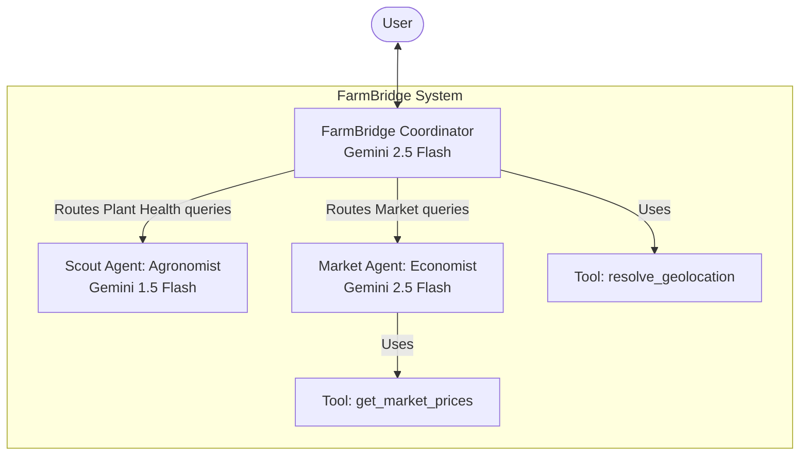

# Project Summary

## Project: FarmBridge

FarmBridge is an agricultural virtual assistant built to support farmers with crop health, soil health, irrigation, pest management, and market pricing insights.

## Architecture

The FarmBridge agent architecture is a hierarchical multi-agent system built using the Google Agent Development Kit (ADK).

- **Coordinator Agent (FarmBridge Root Agent)**: The primary entry point for user interactions. It handles language translation, extracts location data, uses the `resolve_geolocation` tool to get regional context, and orchestrates routing to specialized sub-agents based on the user's inquiry.
- **Scout Agent (Virtual Agronomist)**: A specialized sub-agent focused on crop health, soil health, irrigation, pests, and diseases. It analyzes symptoms and recommends organic treatments.
- **Market Agent (Market Expert)**: A specialized sub-agent for agricultural commodities and market trends. It uses the `get_market_prices` tool to fetch current prices and advises on optimal harvest timing, converting prices to the local currency.

